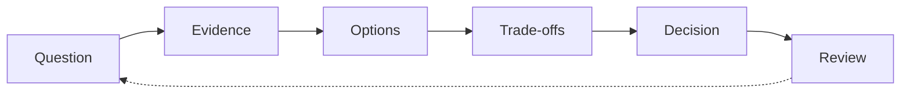

# Decision Framework

A significant decision is one that is expensive or slow to reverse.

## What this means for us

Every significant decision is recorded with the question, the evidence considered, the options, the trade-offs accepted, the owner and a review date. Decisions are searchable across the whole of CustomerFirst.

## Good looks like

- the question written before the answer
- at least one genuinely viable alternative option
- trade-offs stated as costs we accept, not risks we note
- a review date that someone actually honours

## Anti-patterns

- decisions recorded after the fact to justify a direction
- options lists containing one real option and two straw men
- decision latency measured in months because no owner was named
