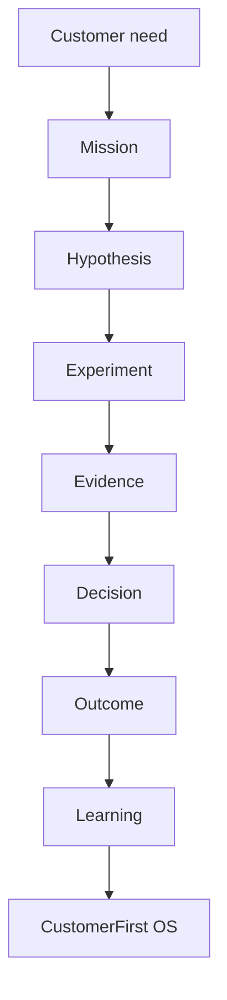

# Delivery Lifecycle

Each stage exists to answer a different question.

| Stage | Question it answers |
| --- | --- |
| Discover | What is actually happening for customers? |
| Define | What outcome are we pursuing, and what must be true? |
| Experiment | Which assumptions survive contact with reality? |
| Deliver | Can we make the change work in service? |
| Measure | Did the outcome move? |
| Adapt | What do we change given the evidence? |
| Scale | Where else does this hold? |

## Anti-patterns

- treating stages as sign-off gates
- moving to Deliver with untested primary hypotheses
