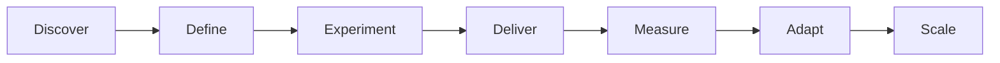

# Mission Model

A mission is focused multidisciplinary work organised around a customer outcome, not a deliverable.

## Lifecycle

A mission may also be **paused**, **stopped** or **completed** at any stage. Stopping because evidence disproved the proposition is a successful outcome: it protects investment.

## What this means for us

We do not report missions as a percentage complete. We report lifecycle stage, current confidence and evidence strength.

## Good looks like

- a written problem statement and named intended outcomes
- hypotheses that could plausibly be wrong
- a mission owner accountable for decisions, not for optimism

## Anti-patterns

- missions defined by the solution they intend to build
- progress reporting that rises while confidence falls
