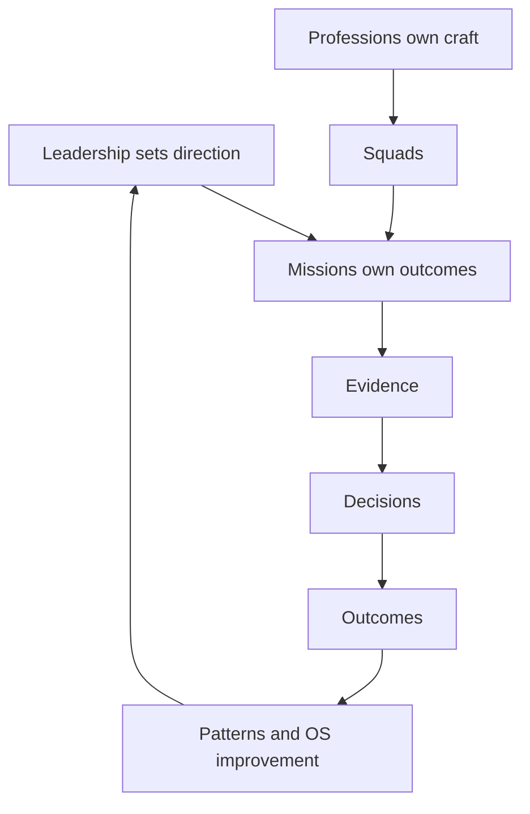

# Operating Model

CustomerFirst is organised around missions, staffed by multidisciplinary squads, supported by professions and enabled by minimum viable governance.

## What this means for us

Missions are temporary and outcome-shaped. Professions are permanent and craft-shaped. Nobody reports to a project plan.

## Good looks like

- every person knows their mission outcome and their profession home
- decisions are taken at the level with the most evidence
- the operating model changes through reviewed pull requests

## Anti-patterns

- permanent missions
- professions acting as approval gates
